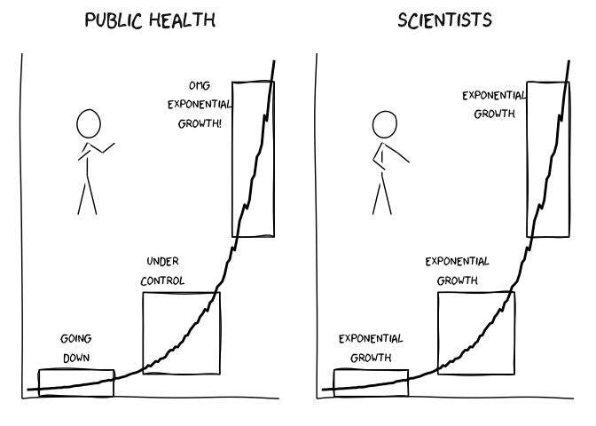

Public Health vs Scientists
================
Jens von Bergmann
17/03/2021

This repo has the code for the somewhat popular xkcd-style graphic I
made. Anyone is welcome to use and adapt the code or graphic for their
own purposes.

<blockquote class="twitter-tweet">
<p lang="en" dir="ltr">
I have been thinking about how different people interpret data
differently. And made this xkcd style graphic to illustrate this.
<a href="https://t.co/a8LvlmZxT7">pic.twitter.com/a8LvlmZxT7</a>
</p>
— Jens von Bergmann (@vb\_jens)
<a href="https://twitter.com/vb_jens/status/1372251931444350976?ref_src=twsrc%5Etfw">March
17, 2021</a>
</blockquote>
<script async src="https://platform.twitter.com/widgets.js" charset="utf-8"></script>

``` r
set.seed(123)
data <- tibble(x=seq(0,100)) %>%
  mutate(y=exp(0.05*x)) %>%
  mutate(xend=lead(x),
         yend=lead(y)) %>%
  mutate(yy=y*runif(nrow(.),0.95,1.05))

boxes <- bind_rows(
  tibble(xmin=5,xmax=35,ymin=-2,ymax=10,x=20,y=20,l1="Going\ndown",l2="Exponential\ngrowth"),
  tibble(xmin=47,xmax=78,ymin=8,ymax=45,x=55,y=55,l1="Under\ncontrol",l2="Exponential\ngrowth"),
  tibble(xmin=83,xmax=100,ymin=70,ymax=140,x=70,y=130,l1="OMG\nExponential\ngrowth!",l2="Exponential\ngrowth")
) %>%
  pivot_longer(c("l1","l2"))

ratioxy=0.8
dataman <- data.frame( x= 25, y=120,
                       scale = 15 ,
                       ratioxy = ratioxy,
                       angleofspine =  -pi/2  ,
                       anglerighthumerus = c(-pi/6, -pi/6),
                       anglelefthumerus = c(-pi/2 - pi/6, -pi/2 - pi/6),
                       anglerightradius = c(pi/5, -pi/5),
                       angleleftradius = c(pi/5, -pi/5),
                       angleleftleg = 3*pi/2  + pi / 12 ,
                       anglerightleg = 3*pi/2  - pi / 12,
                       angleofneck = runif(1, 3*pi/2-pi/10, 3*pi/2+pi/10),
                       name=c("l1","l2"))
mapping <- aes(x,  y,
                scale,ratioxy,angleofspine,
               anglerighthumerus,anglelefthumerus,anglerightradius,
               angleleftradius,angleleftleg,anglerightleg,angleofneck)
```

``` r
set.seed(123)
ggplot(data) +
  geom_line(aes(x=x,y=yy),size=1) +
  scale_x_continuous(breaks=NULL,minor_breaks = NULL) +
  scale_y_continuous(breaks=NULL,minor_breaks = NULL) +
  theme_xkcd() +
  theme(strip.text = element_text(size = 20)) +
  xkcdaxis(xrange=c(0,100),yrange=c(0,150)) +
  xkcdrect(data=boxes,aes(xmin=xmin,xmax=xmax,ymin=ymin,ymax=ymax),colour="black",fill=NA) +
  geom_text(data=boxes,aes(x=x,y=y,label=value),family="xkcd",size=4) +
  xkcdman(mapping,dataman) +
  labs(x=NULL,y=NULL) +
  facet_wrap("name",labeller = as_labeller(c(l1="Public Health",l2="Scientists")))
```

<!-- -->
