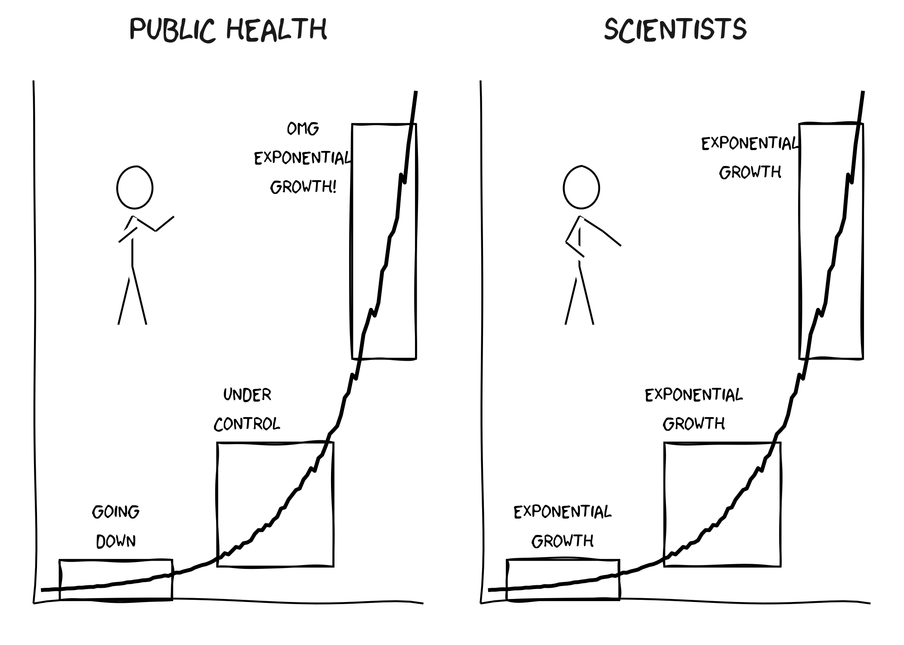
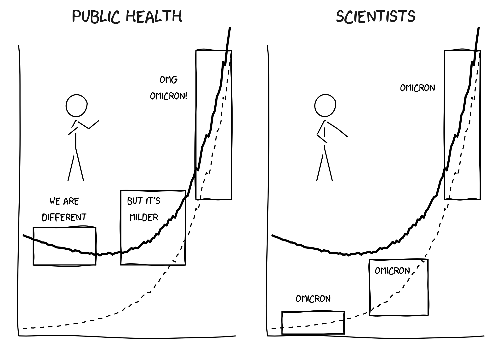

Public Health vs Scientists
================
Jens von Bergmann
17/03/2021

This repo has the code for [a somewhat popular xkcd-style graphic I
made](https://twitter.com/vb_jens/status/1372251931444350976?s=20).
Anyone is welcome to use and adapt the code or graphic for their own
purposes. In particular, people are welcome to adapt this to their local
setting, either by translating or by changing the title from “Public
Health” to “Politicians” as may be appropriate for in some
jurisdictions.

This code uses the [xkcd R
package](https://cran.r-project.org/package=xkcd) to produce an
xkcd-style graphic.

``` r
library(tidyverse)
library(xkcd)

set.seed(123)

# generate the exponential curves with random noise
data <- tibble(x=seq(0,100)) %>%
  mutate(y=exp(0.05*x)) %>%
  mutate(xend=lead(x),
         yend=lead(y)) %>%
  mutate(yy=y*runif(nrow(.),0.95,1.05))

# boxes for highlighting different "phases" of exponential growth
boxes <- bind_rows(
  tibble(xmin=5,xmax=35,ymin=-2,ymax=10,x=20,y=20,
         l1="Going\ndown",l2="Exponential\ngrowth"),
  tibble(xmin=47,xmax=78,ymin=8,ymax=45,x=55,y=55,
         l1="Under\ncontrol",l2="Exponential\ngrowth"),
  tibble(xmin=83,xmax=100,ymin=70,ymax=140,x=70,y=130,
         l1="OMG\nExponential\ngrowth!",l2="Exponential\ngrowth")
) %>%
  pivot_longer(c("l1","l2"))

# stick men for decoration
ratioxy=0.8
dataman <- data.frame( x= 25, y=120,
                       scale = 15 ,
                       ratioxy = ratioxy,
                       angleofspine =  -pi/2  ,
                       anglerighthumerus = c(-pi/6, -pi/6),
                       anglelefthumerus = c(-pi/2 - pi/6, -pi/2 - pi/6),
                       anglerightradius = c(pi/5, -pi/5),
                       angleleftradius = c(pi/5, -pi/5),
                       angleleftleg = 3*pi/2  + pi / 12 ,
                       anglerightleg = 3*pi/2  - pi / 12,
                       angleofneck = runif(1, 3*pi/2-pi/10, 3*pi/2+pi/10),
                       name=c("l1","l2"))
mapping <- aes(x,  y,
                scale,ratioxy,angleofspine,
               anglerighthumerus,anglelefthumerus,anglerightradius,
               angleleftradius,angleleftleg,anglerightleg,angleofneck)

ggplot(data) +
  geom_line(aes(x=x,y=yy),size=1) +
  scale_x_continuous(breaks=NULL,minor_breaks = NULL) +
  scale_y_continuous(breaks=NULL,minor_breaks = NULL) +
  theme_xkcd() +
  theme(strip.text = element_text(size = 20)) +
  xkcdaxis(xrange=c(0,100),yrange=c(0,150)) +
  xkcdrect(data=boxes,aes(xmin=xmin,xmax=xmax,ymin=ymin,ymax=ymax),colour="black",fill=NA) +
  geom_text(data=boxes,aes(x=x,y=y,label=value),family="xkcd",size=4) +
  xkcdman(mapping,dataman) +
  labs(x=NULL,y=NULL) +
  facet_wrap("name",labeller = as_labeller(c(l1="Public Health",l2="Scientists")))
```

<!-- -->

## Omicron version

``` r
library(tidyverse)
library(xkcd)

set.seed(123)

data <- tibble(x=seq(0,100)) %>%
  mutate(y=exp(0.05*x)) %>%
  mutate(xend=lead(x),
         yend=lead(y)) %>%
  mutate(yy=y*runif(nrow(.),0.95,1.05)) %>%
  mutate(wt=50*exp(-0.01*x)**runif(nrow(.),0.95,1.05))

# boxes for highlighting different "phases" of exponential growth
boxes <- bind_rows(
  tibble(xmin=5,xmax=35,ymin=-2,ymax=10,x=20,y=20, name = "l2",value="Omicron"),
  tibble(xmin=47,xmax=75,ymin=8,ymax=38,x=58,y=35, name = "l2",value="Omicron"),
  tibble(xmin=83,xmax=100,ymin=70,ymax=150,x=70,y=130, name = "l2",value="Omicron"),
  tibble(xmin=5,xmax=35,ymin=35,ymax=55,x=20,y=65, name = "l1",value="We are\ndifferent"),
  tibble(xmin=47,xmax=78,ymin=35,ymax=75,x=58,y=65, name = "l1",value="But it's\nnmilder"),
  tibble(xmin=83,xmax=100,ymin=70,ymax=150,x=70,y=130, name = "l1",value="OMG\nOmicron!"),
) 

# stick men for decoration
ratioxy=0.8
dataman <- data.frame( x= 25, y=120,
                       scale = 15 ,
                       ratioxy = ratioxy,
                       angleofspine =  -pi/2  ,
                       anglerighthumerus = c(-pi/6, -pi/6),
                       anglelefthumerus = c(-pi/2 - pi/6, -pi/2 - pi/6),
                       anglerightradius = c(pi/5, -pi/5),
                       angleleftradius = c(pi/5, -pi/5),
                       angleleftleg = 3*pi/2  + pi / 12 ,
                       anglerightleg = 3*pi/2  - pi / 12,
                       angleofneck = runif(1, 3*pi/2-pi/10, 3*pi/2+pi/10),
                       name=c("l1","l2"))
mapping <- aes(x,  y,
                scale,ratioxy,angleofspine,
               anglerighthumerus,anglelefthumerus,anglerightradius,
               angleleftradius,angleleftleg,anglerightleg,angleofneck)

ggplot(data) +
  geom_line(aes(x=x,y=yy+wt),size=1) +
  geom_line(aes(x=x,y=yy),size=0.5,linetype="dashed") +
  scale_x_continuous(breaks=NULL,minor_breaks = NULL) +
  scale_y_continuous(breaks=NULL,minor_breaks = NULL) +
  theme_xkcd() +
  theme(strip.text = element_text(size = 20)) +
  xkcdaxis(xrange=c(0,100),yrange=c(0,150)) +
  xkcdrect(data=boxes,aes(xmin=xmin,xmax=xmax,ymin=ymin,ymax=ymax),colour="black",fill=NA) +
  geom_text(data=boxes,aes(x=x,y=y,label=value),family="xkcd",size=4) +
  xkcdman(mapping,dataman) +
  labs(x=NULL,y=NULL) +
  facet_wrap("name",labeller = as_labeller(c(l1="Public Health",l2="Scientists")))
```

<!-- -->
