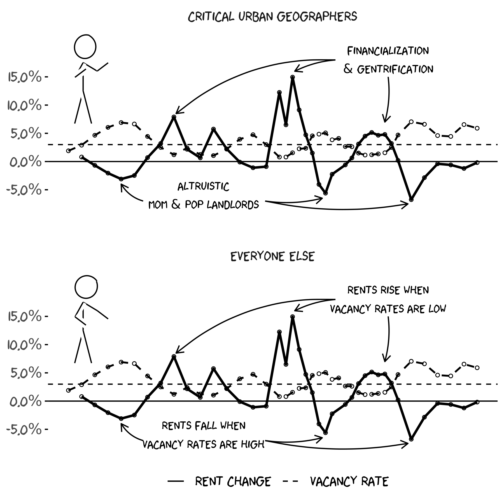

Vacancy rates and rent change (xkcd style)
================
Jens von Bergmann
18/02/2022

This graph is based on [CMHC Rms
data](https://doodles.mountainmath.ca/blog/2022/02/18/vacancy-rates-and-rent-change-2021-update/),
combining Edmonton and Calgary to reduce noise. Edmonton and Calgary are
good examples for highlighting the relationship between rents and
vacancy rates because they don’t have rent control, fairly elastic
housing supply, and have gone through several economic boom-bust cycles.

The rent change is fixed-sample rent change adjusted for inflation.
Fixed sample means that for each cycle it compares rents across the same
set of physical units, avoiding it getting skewed by compositional
effects like a lot of new units coming online in a particular year.

The code for the graph is [available for anyone to reproduce or
adapt](https://github.com/mountainMath/xkcd_exponential/blob/main/rental_xkcd.Rmd).

<!-- -->
